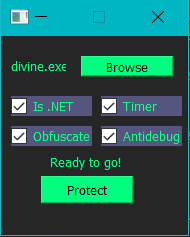

# DivinityProtector
## What is it?
A crypter written in Python with use of PyQt5 UI, supporting both <b>.NET</b> and <b>Native</b> (x32/64) executables.
## What functions does it have?
Currently implemented methods are <b>obfuscation</b>, <b>timer</b> check with random delay and <b>anti debugging</b>.
## What is the advantage of a crypter being written in Python?
This list of features can be easily extended by adding new UI components and payload code updates. Thanks to the rather small codebase and easy-to-understand syntax,
you should be able to build on top of it and make your own FUD crypter in Python!
## Is there more to it?
Yes, way more. Besides the ability of bypassing any static detections by dynamic code packing (runtime code <b>reflection</b>) thanks to `exec()` built-in, 
it uses nuitka to compile stub so the <b>output</b> executable <b>is native</b>.
## Where can I get a more stable crypter for my projects?
If you are looking for an enterprise solution for protecting your digital products,
try out our <a href="https://shoppy.gg/product/tCrgNdO">BitCrypter</a>.

The source used to have an icon picker alongside with additional payload encryption,
but these features were considered useless and removed to preserve clean GUI. 
